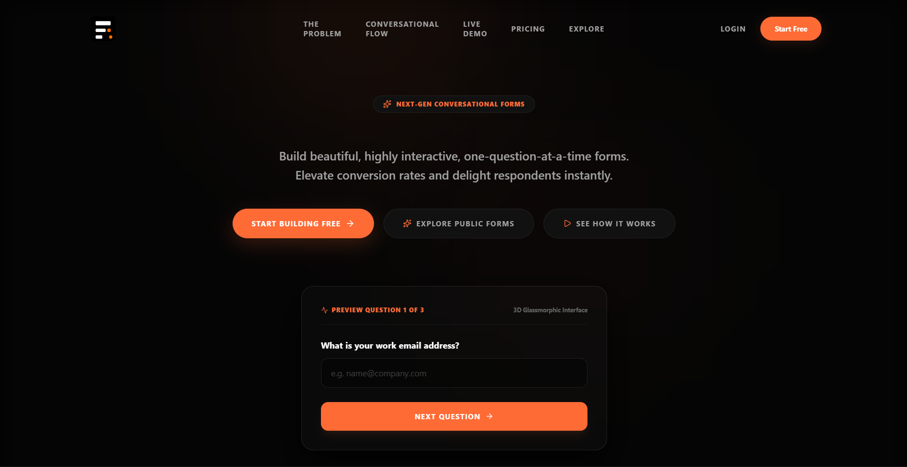
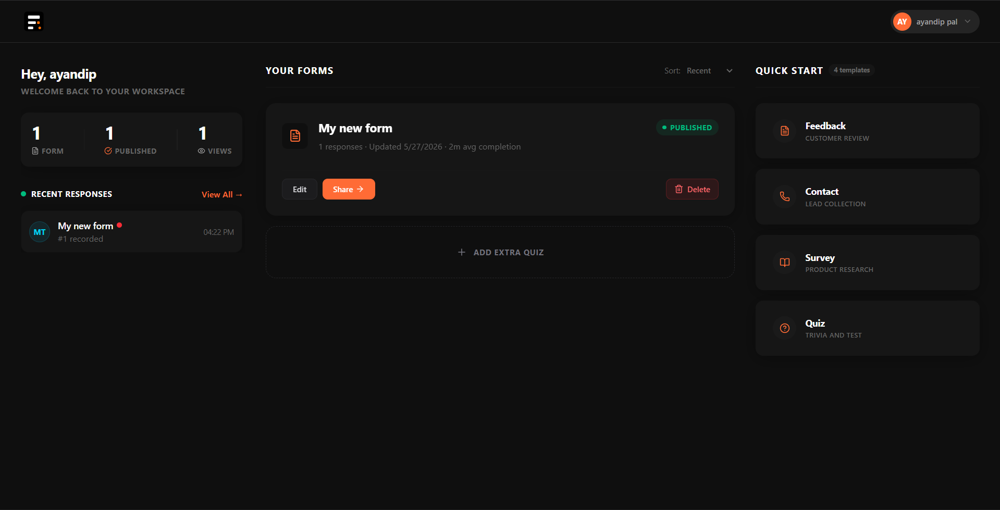
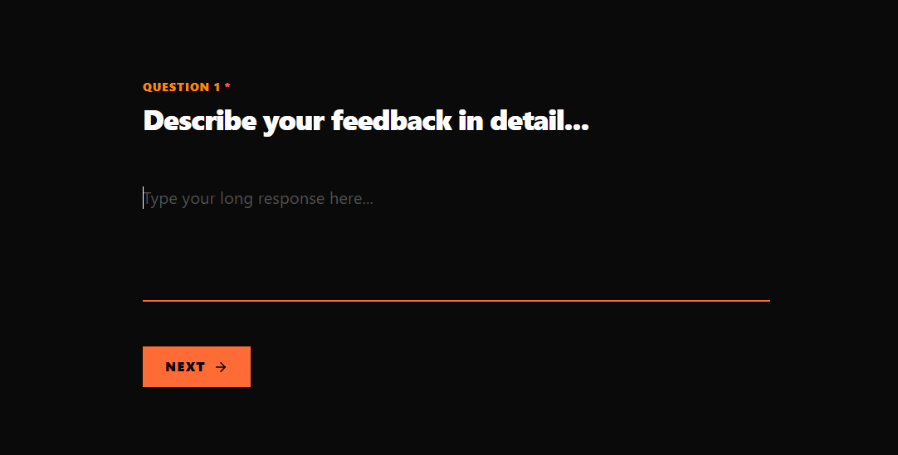

<div align="center">
  
</div>

<h1 align="center">Fomz</h1>

<div align="center">
  
  
  
  
  
  
  
  
  
  
  
  
  
  
  
  
</div>

<br/>

## The Problem

Let's face it: **traditional forms are incredibly lengthy, boring, and tedious.** Whether it's a survey, a feedback form, or an application, presenting a user with a massive wall of inputs inevitably leads to fatigue. Many people simply close the tab rather than fill them up, resulting in massive drop-off rates and lost data for creators.

## The Solution: Fomz

**Fomz** completely reimagines the data collection experience. Instead of an overwhelming wall of fields, Fomz uses an **interactive, beautiful, slide-by-slide format**. 

By breaking down complex data entry into bite-sized, single-question interactions, we eliminate cognitive overload. The UI is heavily focused on sleek aesthetics, micro-animations (powered by Framer Motion), and keyboard-friendly navigation. This creates an experience that feels less like a chore and more like an engaging conversation. 

Whether you are creating a quick feedback quiz or a comprehensive application, Fomz ensures your respondents stay engaged from the first question to the final submit button—drastically increasing your conversion and completion rates.

---

## Gallery

*(Note: Replace these image placeholders with your actual screenshot URLs)*

<div align="center">
  <!-- Big Landing Screenshot -->
  
</div>
<br/>
<div align="center">
  <!-- Side-by-Side Screenshots -->
  
  
</div>

---

## Quick Start Guide

Follow these simple instructions to get the Fomz monorepo running on your local machine.

### System Prerequisites
To successfully run this project locally, your system **must have** the following installed:
- **Node.js** (v18 or higher)
- **pnpm** (Package manager used for this monorepo)
- **Docker & Docker Compose** (Required for the database and Redis instances)

### Step 1: Clone and Install
First, clone the repository and install all dependencies via `pnpm`:

```bash
git clone https://github.com/your-username/fomz.git
cd fomz
pnpm install
```

### Step 2: Environment Setup
The project uses a `.env` file at the root level for configuration. You can use the provided template to get started. Make sure your `.env` file is populated with your required secrets (OAuth, SMTP, Cloudinary, Database connection, etc.).

### Step 3: Start Infrastructure (Docker)
We use Docker to easily spin up our PostgreSQL database and Redis (Valkey) instance. Run the following command at the root of the project:

```bash
docker-compose up -d
```
*This starts the containers in detached mode.*

### Step 4: Database Initialization
With the database running, you need to generate the Prisma client and run the migrations to set up the tables:

```bash
pnpm run db:generate
pnpm run db:migrate
```

### Step 5: Start the Development Server
Everything is ready! Start the Turborepo development server to run both the frontend web app and backend API concurrently:

```bash
pnpm run dev
```

---

## Local Navigation

Once the development server is up and running, you can access the different parts of the application here:

- 🌐 **Web Frontend (Next.js):** [http://localhost:3000](http://localhost:3000)
- ⚙️ **API Backend (Express):** [http://localhost:8000/api](http://localhost:8000/api)
- 📚 **Scalar API Documentation:** [http://localhost:8000/docs](http://localhost:8000/docs)
<div align="center">
  <br/>
  <p>\\[T]/\\[T]/\\[T]/\\[T]/\\[T]/\\[T]/\\[T]/\\[T]/\\[T]/\\[T]/\\[T]/\\[T]/\\[T]/</p>
  <p>Made with a lot of coffee and love ❤️</p>
  <p>Praise the Sun! ☀️</p>
  
</div>
